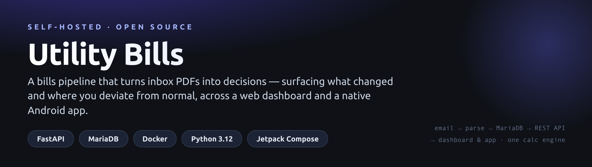
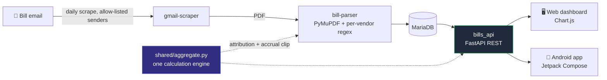

<p align="center">
  
</p>

<p align="center">
  A self-hosted system that turns the utility-bill PDFs landing in your inbox into a
  clean, trustworthy view of household spending — telling you <b>what changed</b> and
  <b>where you're deviating from normal</b>, not just the totals.
</p>

<p align="center">
  
  
  
  
  
  
</p>

## How it works



Four containers — `gmail-scraper`, `bill-parser`, `api-server`, `mariadb` — and one
shared calculation engine so the dashboard, the API and the app can never disagree.

## What's notable

- **One source of truth for the maths.** [`shared/aggregate.py`](shared/aggregate.py)
  owns cost-month attribution (water by period-end, network/transport bills by
  service month, insurance spread across its period, pellets across the heating
  season) and the *accrual clip* — so the dashboard, the API and the app can never
  disagree. A transport bill invoiced in June for May service is counted in May.
- **Decision support, not a read-out.** `GET /api/bills/summary` compares the latest
  complete month to each category's own trailing-6-month baseline and returns the
  **deviations** (with anomaly flags for genuine spikes) and unit-cost trends — the
  data behind the app's "what changed / biggest movers" screen.
- **Config-driven parsing.** Each vendor is a YAML file under
  [`config/vendors/`](config/vendors) — regexes, keywords, gates. Adding a vendor is
  a config change, not code.
- **Google Sign-In with a server-side allowlist.** `POST /api/auth/google` verifies
  the Google ID token and accepts exactly one allow-listed email, then issues a
  session JWT. No shared password ships in the app.
- **Tested.** `tests/unit` covers the parser, the aggregation/clip parity, the
  deviation maths, and the auth paths.

## REST API

| Endpoint | Purpose |
|---|---|
| `GET /` | The interactive dashboard (HTML) |
| `POST /api/auth/google` | Google ID token → session JWT (single-email allowlist) |
| `GET /api/bills/summary` | KPIs, deviations vs baseline, latest unit costs |
| `GET /api/bills/series` | Full monthly aggregates (cost, consumption, unit costs) |
| `GET /api/bills` | Parsed bills, each stamped with its attributed `cost_month` |
| `GET /api/bills/monthly-totals`, `/trends`, `/per-unit-costs` | Aggregates & comparisons |
| `GET /api/meter-readings` | Per-period usage |
| `GET /bills/{file}` | The original bill PDF |

All `/api/*` routes accept a Bearer session JWT (app) or the internal `X-API-Key`
(server-side callers).

## The apps

- **Web dashboard** — served at `/`; stacked monthly costs, unit-cost trends,
  year-over-year, consumption, forecast. Demo with synthetic data:
  [`demo/dashboard_demo.html`](demo/dashboard_demo.html).
- **Android app** — native Jetpack Compose client with a decision-support home
  screen, interactive charts, offline cache and Google Sign-In:
  **[github.com/Arut-A/household-bills](https://github.com/Arut-A/household-bills)**.

### Web dashboard

| Overview | Unit costs | Comparison |
|:---:|:---:|:---:|
|  |  |  |

## Run it

```bash
cp .env.example .env        # fill in DB passwords, API key, Google client ID, allowlist
docker compose up -d        # mariadb + bill-parser + api-server + gmail-scraper
./deploy.sh                 # runs tests, builds, health-checks (Synology-friendly)
```

The Gmail scraper needs an OAuth credential at `credentials/gmail_credentials.json`
(see [`docs/SETUP.md`](docs/SETUP.md)). Secrets live in `.env` (git-ignored); raw
PDFs, credentials and the generated dashboard are never committed.

## Docs

[Architecture](docs/ARCHITECTURE.md) · [API](docs/API.md) ·
[Setup](docs/SETUP.md) · [Vendor config](docs/VENDOR_CONFIG.md)

## License

[MIT](LICENSE) © 2026 Arut-A
